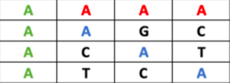

# Code Challenge: Mutant Back End

This challenge was implemented with the use of Java + Spring Boot, Redis was used for persistence and this application
is currently deployed in azure.

## Considerations

Some considerations were taken into account, such as the following:

1. When overlapping diagonals, verticals or horizontals where all meet the condition of having four equal letters, 
   each is counted independently. example:
   
   

2. When calculating statistics, if the number of humans becomes zero, then the ratio is zero.
   considerations
   
## Instructions to run the application

This application exposes the following api:

The url for the api is:
```
dna-mutant.azurewebsites.net
```

```JSON
   POST -> /mutant/
   {
      "dna":["ACGTATT", "CTAGTAG", "CGTTTTA", "ACTCGAT", "ATCTGAA", "AGACGCT", "ATCGGGG"]
   }
```
In case of a mutant check, returns HTTP 200-OK, otherwise 403-FORBIDDEN

```JSON
   GET -> /stats/
  {
     "ration":1.5,
     "count_mutant_dna":9,
     "count_human_dna":6
  }
```


